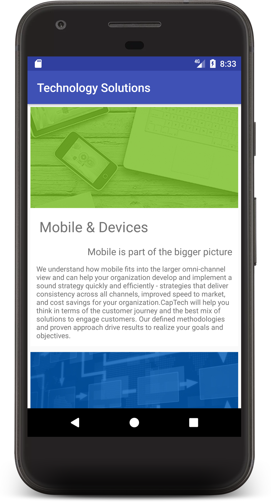

##Intro

If you haven't heard by now, one of the biggest announcements at Google IO was Android's official support for Kotlin. Over the past couple of years, Kotlin has gained a large following in the Android Community, and the official support is great response to that by the Android Team at Google.

There are many blogs that already take a deep dive into Kotlin as a language, and I encourage you to check those posts and the official [Kotlin Documentation](https://kotlinlang.org/) out. The purpose of this blog, however, is to look at an end to end product implemented in Kotlin with an Android only lens. I will demonstrate how to get up and running with Kotlin in the latest version of Android Studio, mention a few great Kotlin features that are especially important to Android Developers, and also show you how to do common Android tasks such as adhere to the Model-View-Presenter (MVP) pattern, create parcelables, start activities, etc.

In this blog and in the attached application, you will find the following frameworks and patterns demonstrated: Fresco, RxJava, RecyclerViews, Gson, Model-View-Presenter(MVP) Pattern, Parcelables, Generics, and Kotlin Extensions

See full post at [captechconsulting.com](captechconsulting.com)

